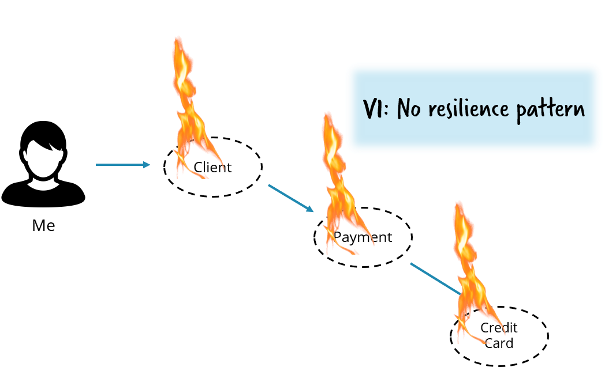

# Flowing Retail

This sample application demonstrates a simple order fulfillment system, decomposed into multiple independent components (that is to say: _microservices_).

The repository contains code for multiple implementation alternatives to allow a broad audience to understand the code and to compare alternatives. The [table below](#alternatives) lists these alternatives.

The example respects learnings from **Domain Driven Design (DDD)**, Event Driven Architecture (EDA) and **Microservices (µS)** and is designed to give you hands-on access to these topics.

**Note:** The code was written in order to be explained. Hence, I favored simplified code or copy & paste over production-ready code with generic solutions. **Don't consider the coding style best practice! It is purpose-written to be easily explainable code**.

Flowing retail simulates a very easy order fulfillment system:

## Architecture and implementation alternatives

The most fundamental choice is to select the **communication mechanism**:

* **[Apache Kafka](kafka/)** as event bus (could be easily changed to messaging, e.g. RabbitMQ): 
* **[REST](rest/)** communication between Services.
  * This example also shows how to do **stateful resilience patterns** like **stateful retries** leveraging a workflow engine.
* **[Zeebe](zeebe/)** broker doing work distribution.

After the communication mechanism, the next choice is the **workflow engine**:

* **Camunda BPM 7**
* **Zeebe** (if you are interested why Zeebe is listed in the communication mechanism as well as workflow engine please look into the [Zeebe example readme](zeebe/))
* **Zeebe hosted on Camunda Cloud**

and the **programming language**:

* **Java**
* **Go**
* **JavaScript / TypeScript**

## Storyline

Flowing retail simulates a very easy order fulfillment system. The business logic is separated into the services shown above (shown as a [context map](https://www.infoq.com/articles/ddd-contextmapping)).

### Long running services and orchestration

Some services are **long running** in nature - for example: the payment service asks customers to update expired credit cards. A workflow engine is used to persist and control these long running interactions.

### Workflows live within service boundaries

Note that the state machine (_or workflow engine in this case_) is a library used **within** one service. If different services need a workflow engine they can  run whatever engine they want. This way it is an autonomous team decision if they want to use a framework, and which one:

### Resilience patterns for synchronous communication

You also have to deal with basic communication problems, the specifics of which depend on the means of communication (for example: _asynchronous messaging_ vs. _blocking synchronous REST calls_). You might use stateful retries for this.

### See [REST example](rest/).

## Links and background reading

* Introduction blog post: https://blog.bernd-ruecker.com/flowing-retail-demonstrating-aspects-of-microservices-events-and-their-flow-with-concrete-source-7f3abdd40e53
* InfoQ-Writeup "Events, Flows and Long-Running Services: A Modern Approach to Workflow Automation": https://www.infoq.com/articles/events-workflow-automation
* InfoWorld article "3 common pitfalls of microservices integration—and how to avoid them": https://www.infoworld.com/article/3254777/application-development/3-common-pitfalls-of-microservices-integrationand-how-to-avoid-them.html
