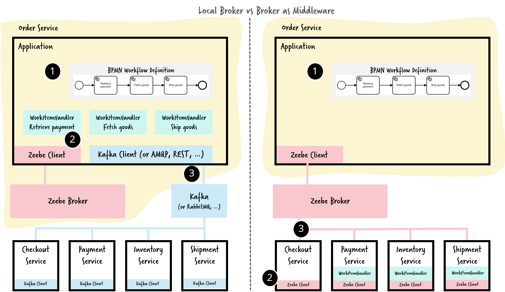

# Flowing Retail / Zeebe

This folder contains services that leverage the horizontally scalable workflow engine Zeebe for work distribution and as means of communication.

One important aspect of this design is that Zeebe is used as central middleware. By doing this, you don't need any other messaging system like Apache Kafka or RabbitMQ. This might feel unusual for you - but we know of a number of projects taking this approach, for various reasons. We discuss the differences of the alternatives below.

In order to use Zeebe as orchestrator, a workflow model describing the orchestration is deployed from the order service to the broker. The services then subscribe to work items of that workflow. Zeebe publishes the work and streams it to the corresponding clients:


Note that the workflow model is owned by the Order Service and deployed from there to the broker automatically, during startup of the service. The broker then versions it and runs it.

Now Zeebe is the only common denominator. For every service you can decide for **programming language**.


You find the variations in the sub folders. 

* [Java](java/)
* [Node.js](nodejs/)

## Run on Camunda Cloud

[Camunda Cloud](https://camunda.io) provides a hosted version of Zeebe for you. After sign up you can easily spin up your Zeebe cluster as described here.

In order to run this example on the Cloud you simply have to configure the Zeebe cient correctly, e.g.: 

* For Nodejs

You can cut and paste the environment variable block from the [Camunda Cloud console](https://camunda.io) to set the configuration through the environment.

* For Java

```
@Configuration
public class ZeebeClientConfiguration {
  
  @Bean
  public ZeebeClient zeebe() {
    final String clusterUUID = "34b386b1-9bc7-4009-8e50-416124a28922";
    final String baseUrl = "zeebe.camunda.io";
    final String clientId = "tjYd6oErFeLqIYNdkRX4cG1BKjWpPz8m";
    final String clientSecret = "_VO8wOg17xzzOWB6a6a_Y7JgXs6YjZhFBeYCHqEehZQYs1xjA4xJLNautxlsfSlw";
    final String authUrl = "https://login.cloud.camunda.io/oauth/token";

    final String broker = clusterUUID + "." + baseUrl + ":443";

    final OAuthCredentialsProviderBuilder c = new OAuthCredentialsProviderBuilder();
    final OAuthCredentialsProvider cred = c.audience(clusterUUID + "." + baseUrl).clientId(clientId)
        .clientSecret(clientSecret).authorizationServerUrl(authUrl).build();

    final ZeebeClientBuilder clientBuilder = ZeebeClient.newClientBuilder().brokerContactPoint(broker)
        .credentialsProvider(cred);

    return clientBuilder.build();
  }
}
```

## Does Zeebe complement or replace middleware?

In the above example, I replaced Apache Kafka with Zeebe. Choosing between these architecture alternatives is interesting. The following picture visualizes the difference:



As always, it depends on the circumstances as to which architecture will be the best fit in your scenario.

If your motivation is to use Zeebe as **Saga Coordinator** than it is natural to run a central broker, as this can sort out all consistency behavior of your Sagas for you. See e.g. https://www.youtube.com/watch?v=0UTOLRTwOX0.

If you **orchestrate your microservices** you might want to follow the [Smart Endpoints and Dumb pipes](https://martinfowler.com/articles/microservices.html#SmartEndpointsAndDumbPipes) approach from Martin Fowler. This might look like having Apache Kafka as dumb pipe and put all the "smartness" into the services, for example, the workflow executed in Zeebe.

However, in reality a lot of projects struggle with operating messaging systems (like RabbitMQ) or Apache Kafka. Not only that, I have seen overflowing dead letter queues (resulting in lost messages). But the bigger problem is typically the lack of good operational tooling, so it is difficult to answer questions like: Which messages couldn't get delivered? Why? What is the payload? How to fix payload problems? How to re-deliver a message? To where? 

Hence a lot of companies start to build home-grown *message hospitals* which require a lot of effort.

This is where workflow automation technology can jump in with [good tooling supporting BizDevOps](BizDevOps). This leads a lot of customers to use this architecture and accepting a bit of smartness in the pipe. From my perspective this is absolutely OK, as long as the ownership and development/deployment lifecycle of a workflow model is clearly defined and assigned to a service (compare to [Architecture options to run a workflow engine](https://blog.bernd-ruecker.com/architecture-options-to-run-a-workflow-engine-6c2419902d91)).

So there are a couple of **advantages** of using Zeebe as middleware:

* Less code involved (compare the code of this example to the Kafka/Zeebe example)
* No need to operate an own messaging system or event bus
* Operations tooling from the workflow engine can be used

Of course there are also **downsides**:

* Dependency to Zeebe in a lot of components (the places where you had a Kafka dependency before)
* Requires confidence on Zeebe to play that central role and take the load.

Depending on your choice the workflow model might look a bit different and e.g. the data flow and data mapping might be different (e.g. data mapping in the workflow model instead of the WorkItemHandler).
